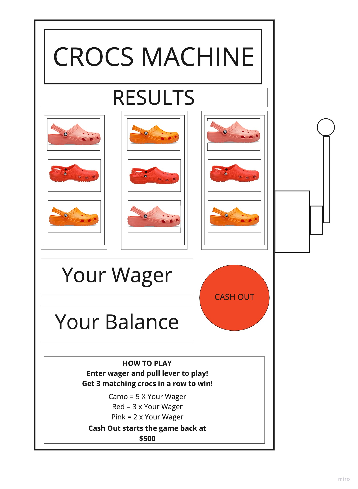

# THE CROCS MACHINE #

## Objective: ##

To create a virtual slot machine where the user can enter a wager, pull the lever, and win or lose based on if they get 3 matching Crocs.

## Game Rules: ##

-The player starts with $500 in their current balance.
-They will enter a wager that is no more than their current balance.
-Once the wager is entered, they will pull the lever to start the game.
-If the player gets 3 Crocs lines up they win.
-If they get 3 camo Crocs in a row they will win their wager times five.
-If they get 3 pink crocs in a row they will win their wager times three.
-If they get 3 orange crocs in a row they will win their wager times two.
-Any other results equal a loss and they will lose their wager amount.
-Once the player's balance equals $0 the game will no longer function.
-The player can cash out at any time which will return the balance to $500

## Wireframe: ##





## Technologies: ##

**This game features the following languages:**

-HTML

-javaScript

-CSS


## MVP: ##

-As a user, I want to see a basic slot machine
 
 ```<create game>```

-As a user, I want to start with a balance of $500

-As a user, I want to be able to enter a wager

-As a user, I want to click the lever

-As a user, I want to see the three reels return with a center line of random results once lever is clicked

-As a user, I want to increase my balance based on if 3 results match

-As a user, I want to subtract my wager from my balance

-As a user, I want to reset my balance to $500 using the "Cash Out Button"

## Version 2: ##

-As a user, I want to see three different multipliers based on different matches

-As a user, I want the game to end if my balance is $0

-As a user, I want an error to occur if I wager more than my balance

-As a user, I want the slot machine to be styled better.

## Version 3: ##

-As a user I want a sound to play if I win a round.

-As a user I want a sound to play if I lose a round.

-As a user, I want the reels to be animated once the lever is clicked.

-As a user, I want the lever to animate when clicked.


Pseudocode:
//javaScript

<create Game>

//Hold DOM elements
<Hold "All Reels">
<Hold "lever">
