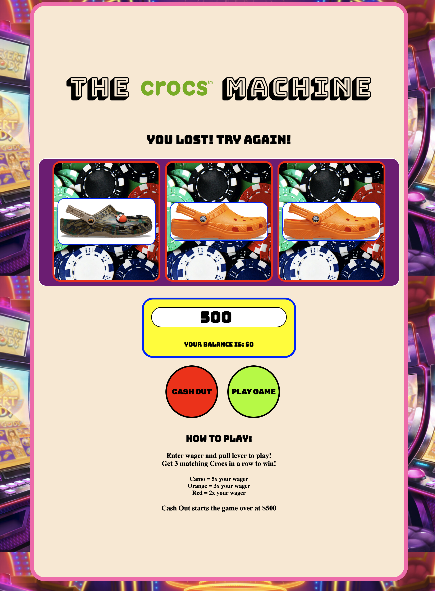

# THE CROCS MACHINE #

## Objective: ##

A virtual slot machine, where you try to match three Crocs to win.

## Technology Used: ##

**This game features the following languages:**

-HTML

-javaScript

-CSS

## Getting Started: ##

**Instructions:**

  -The player starts with $500 in their current balance.

  -They will enter a wager that is no more than their current balance.

  -Once the wager is entered, they will press the "Play Game" button to start the game.

  -If the player gets 3 Crocs lines up they win.

  -If they get 3 camo Crocs in a row they will win their wager times five.

  -If they get 3 pink crocs in a row they will win their wager times three.

  -If they get 3 orange crocs in a row they will win their wager times two.

  -Any other results equal a loss and they will lose their wager amount.

  -Once the player's balance equals $0 the game will no longer function.

  -The player can cash out at any time which will return the balance to $500

## Next Steps: ##

**Version 2:**

    -As a user I want each reel to spin independently and randomly
    -As a user I want to be able to enter my name
    -As a user I want to be able to see a total balance when I cash out

**Version 3:**

    -As a user I want to see a high score board showing names and scores of other players
    -As a user I want to be able to share my results to social media
